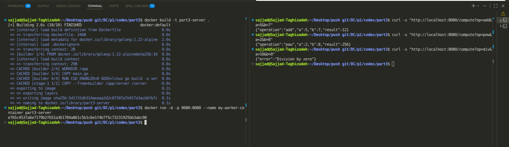

# Part 3: Containerized HTTP Microservice

This document outlines the execution and networking details for the Dockerized HTTP service, as required by the project specifications.

### 1. Docker Image Build Command
To build the Docker image using the provided multi-stage `Dockerfile`, navigate to the `part3` directory and execute the following command. We named the image `part3-server`:
```bash
docker build -t part3-server .

```

### 2. Container Run Command

To start the container in detached mode (background) and map the necessary ports, use the following command:

```bash
docker run -d -p 8080:8080 --name my-worker-container part3-server

```

### 3. Port Number Used

* **Container Port:** `8080`
* **Host Port:** `8080`
The service listens on port 8080 inside the container, which is exposed and mapped to port 8080 on the Host machine.

### 4. Method of Connecting Host to VM

Since the Host operating system is **Ubuntu Linux**, Docker runs natively. The connection method is straightforward **Localhost Port Forwarding**. When the container is executed with the `-p 8080:8080` flag, the Docker daemon automatically binds the container's internal port to the Host's `localhost` loopback interface. Therefore, no complex NAT or Bridged Network configurations (like those required in VirtualBox/Windows) are necessary. The host can directly communicate with the VM service via `127.0.0.1` or `localhost`.

### 5. Sample `curl` Commands

Below are examples of how to invoke the service from the Host's terminal:

**Standard Operations:**

```bash
curl -s "http://localhost:8080/compute?op=add&a=5&b=7"
# Expected Output: {"operation":"add","a":5,"b":7,"result":12}

```

**Bonus Operations:**

```bash
curl -s "http://localhost:8080/compute?op=pow&a=2&b=8"
# Expected Output: {"operation":"pow","a":2,"b":8,"result":256}

```

**Error Handling (Division by Zero):**

```bash
curl -s "http://localhost:8080/compute?op=div&a=10&b=0"
# Expected Output: {"error":"Division by zero"}

```

*

