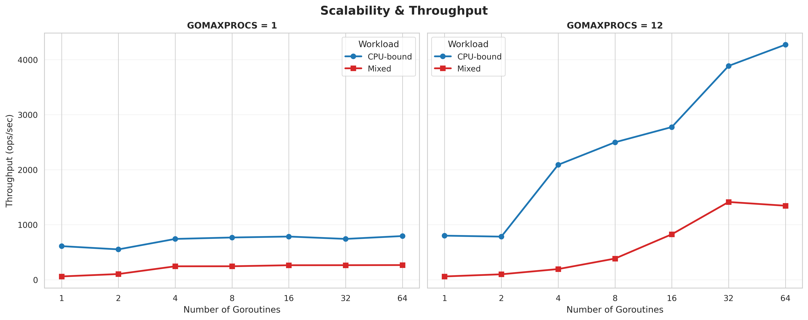
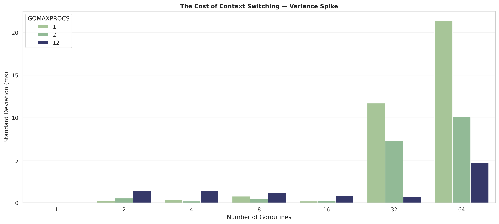
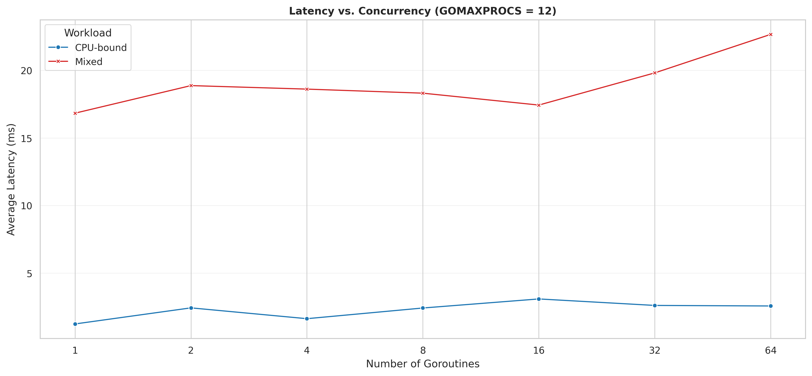

# Final Report

## 1. Architecture and Design Overview

This project is structured into three distinct but conceptually linked parts, progressing from low-level operating system IPC to high-level microservices.

* **Part 1 (Low-level IPC):** Designed as a decoupled Client-Worker architecture. The `Interface` acts as the frontend CLI, responsible for parsing user input and data serialization. The `Worker` runs as a background daemon, executing mathematical operations. The two components are strictly isolated and communicate solely through the file system.
* **Part 2 (Concurrency & Scheduling):** Designed as an in-memory benchmarking engine. It utilizes `sync.WaitGroup` for synchronization and `runtime.GOMAXPROCS` to manipulate hardware threading. The architecture explicitly isolates pure mathematical loops from I/O-simulated loops to stress-test the Go Scheduler.
* **Part 3 (Microservice & Containerization):** Designed as a cloud-native microservice. The core logic from Part 1 was refactored into HTTP handlers. A custom Middleware architecture was introduced to intercept requests for logging and duration tracking. The entire service is packaged using a minimal, zero-dependency Docker approach.

## 2. Communication Protocol (Part 1)

The communication between the Interface and the Worker relies on **Linux Named Pipes (FIFOs)** and structured **JSON** payloads.

* **Transport Layer:** Two unidirectional FIFOs (`/tmp/req_pipe` and `/tmp/res_pipe`) ensure collision-free duplex communication.
* **Application Layer (JSON):** * The Interface serializes user commands into a `Request` struct: `{"operation":"POW", "a":2, "b":8}`.
* The Worker processes this and returns a serialized `Response` struct: `{"result":256, "error":""}`.


* **Validation:** The protocol enforces strict error handling. Invalid operations, non-numeric inputs, or division by zero are caught by the Worker, returning a populated `error` field in the JSON response, which the Interface gracefully displays to the user without crashing.

## 3. Test Scenarios (Part 2)

To evaluate the Go scheduler, we designed a benchmarking matrix testing two distinct workloads across different hardware constraints:

1. **CPU-bound Workload:** A tight, pure-math `for` loop executing 5,000,000 iterations. This simulates tasks that strictly require CPU cycles without yielding.
2. **Mixed Workload:** The same mathematical loop, but infused with intentional `time.Sleep` calls every 500,000 iterations. This simulates I/O-bound tasks (like database queries or network calls) that force the goroutine to block.

**Variables Tested:**

* Logical Processors (`GOMAXPROCS`): `1`, `2`, and `12` (representing Single-core, Dual-core, and True Parallelism).
* Goroutines: Scaled exponentially (`1`, `2`, `4`, `8`, `16`, `32`, `64`).

## 4. Tables and Charts (Part 2)

### Benchmark Results Table

| Workload | GOMAXPROCS | Goroutines | Throughput (ops/sec) | Avg Latency | Max Latency | Std Dev | Total Blocks |
| --- | --- | --- | --- | --- | --- | --- | --- |
| **CPU-bound** | 1 | 1 | 609.97 | 1.63 ms | 1.63 ms | 0s | 0 |
| **Mixed** | 1 | 1 | 59.52 | 16.78 ms | 16.78 ms | 0s | 10 |
| **CPU-bound** | 1 | 64 | 793.37 | 1.25 ms | 1.81 ms | 76.3 µs | 0 |
| **Mixed** | 1 | 64 | 266.04 | 19.53 ms | 152.60 ms | 21.44 ms | 640 |
| **CPU-bound** | 12 | 1 | 800.51 | 1.24 ms | 1.24 ms | 0s | 0 |
| **Mixed** | 12 | 1 | 59.36 | 16.83 ms | 16.83 ms | 0s | 10 |
| **CPU-bound** | 12 | 64 | 4271.52 | 2.57 ms | 3.51 ms | 393.8 µs | 0 |
| **Mixed** | 12 | 64 | 1344.45 | 22.66 ms | 41.37 ms | 4.72 ms | 640 |

### Graphical Analysis


 
 
*

## 5. Analysis of Results

The dataset empirically demonstrates core operating system concepts regarding concurrency versus true parallelism:

1. **CPU-Bound Workloads (The Glass Ceiling):** On a single core (`GOMAXPROCS=1`), throughput for CPU-bound tasks hit a hard ceiling at ~790 ops/sec, regardless of the number of goroutines. Time-slicing a pure math workload yields no performance gain. However, at `GOMAXPROCS=12`, true parallelism is achieved, scaling throughput massively to 4,271 ops/sec. The Go scheduler proved highly fair, maintaining microscopic variance (Std Dev in µs) across these tasks.
2. **Mixed Workloads (Latency Hiding):** Unlike CPU tasks, Mixed workloads scaled excellently even on a single core (from 59 to 266 ops/sec). The `Total Blocks` metric proves that when a goroutine sleeps, the scheduler dynamically swaps in another runnable goroutine, utilizing idle CPU time (Concurrency).
3. **Context Switching Overhead:** The bar charts highlight the penalty of context switching. At 64 goroutines on a single core, waking and queuing sleeping tasks caused massive variance spikes (Std Dev > 21 ms) and pushed Max Latency to 152 ms, proving that over-provisioning goroutines for I/O tasks introduces unpredictability.

## 6. Build and Execution of Part 3

To deploy the HTTP service, we utilized a **Multi-Stage Dockerfile** to ensure maximum security and minimum image size.

**Build Process:**

1. **Stage 1 (Builder):** Uses `golang:1.22-alpine` to compile the `main.go` file. The environment variable `CGO_ENABLED=0` is set to ensure a statically linked, standalone binary is created.
2. **Stage 2 (Production):** Uses the `scratch` image (an entirely empty filesystem). The compiled binary is copied over, resulting in a microscopic, highly secure container image.

**Commands:**

```bash
# 1. Build the Docker Image
docker build -t part3-server .

# 2. Run the Container (mapping port 8080 to the Host)
docker run -d -p 8080:8080 --name my-worker-container part3-server

# 3. Test from the Host Machine
curl -s "http://localhost:8080/compute?op=pow&a=2&b=8"


```
*

## 7. Challenges and Implemented Solutions

During the implementation of this project, several technical challenges were encountered and resolved:

1. **Docker Registry Networking Blocks (i/o timeout):** * *Problem:* While building the Docker image, the system failed to pull the `golang:1.22-alpine` image due to regional networking restrictions and IP blocking by Docker Hub.
* *Solution:* We adapted by either compiling the binary locally using `GOOS=linux` and packing it directly into a `scratch` container, or by configuring the Docker daemon (`daemon.json`) to use localized registry mirrors (e.g., ArvanCloud).


2. **Go Package Namespace Collisions (`DuplicateDecl`):**
* *Problem:* Keeping both `worker.go` and `interface.go` in the same `part1` directory caused the Go language server (Linter) to throw `DuplicateDecl` errors, as it assumed both `main()` functions belonged to the same package.
* *Solution:* Instead of restructuring the project folders, we utilized Go's `//go:build` tags at the top of the files. This elegantly isolated the execution environments, satisfying the linter while keeping the directory clean.


3. **Calculating Advanced Statistics without Third-Party Libraries:**
* *Problem:* The bonus requirement asked for Standard Deviation and block tracking, but we were strictly limited to the Go Standard Library (no external math/stats packages).
* *Solution:* We engineered a custom statistical algorithm using `math.Sqrt` to calculate variance and standard deviation natively. Furthermore, we implemented a manual block-counting mechanism inside the workload functions to accurately track OS-level yields.